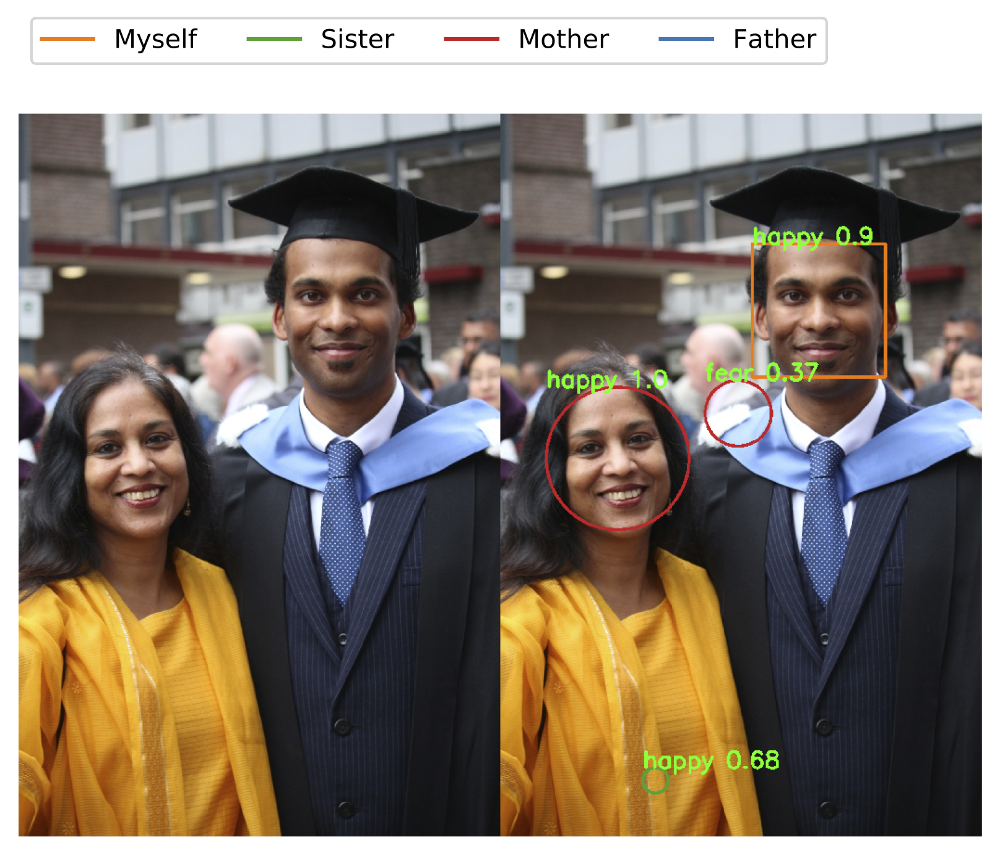

# Optimising Facial Information Extraction and Processing using Convolutional Neural Networks

### About
This project implements 3 core models which are capable for performing the followings tasks - facial recognition, gender classification, and emotion detection.

Futhermore, 2 additional models, provide an end-to-end pipeline of all three tasks. Specifically:

```RestoreModel.py``` performs all three tasks on given static images.

```LiveModel.py``` performs all three tasks on given real-time images taken from device's webcam.

### Requirements
```
seaborn==0.9.0
Keras==2.2.4
numpy==1.16.4
opencv_python_headless==4.1.0.25
mtcnn==0.0.9
albumentations==0.3.0
matplotlib==3.1.0
tensorflow==1.14.0
pandas==0.24.2
ipython==7.8.0
MyMethods==1.0.0
scikit_learn==0.21.3
```

### Installation
```
pip install -r requirements.txt
```

### Usage
```
$ python3 LiveInput.py
```

### Common Errors

Sample error:
```
OpenCV(4.1.0) /Users/travis/build/skvark/opencv-python/opencv/modules/objdetect/src/cascadedetect.cpp:1658: error: (-215:Assertion failed) !empty() in function 'detectMultiScale'
```

Cause: a .DS_Store file in the directory of the images causes this error.

Solution: navigate to the directory containing the images, and delete the file in question.
```
$ cd TestImages
$ rm -rf .DS_Store
```

### Deprecation Warnings
TensorFlow might give out a list of deprecation warnings - these can be safetly ignored.

### Admin Permissions
Note that this script might require administrative permissions in order to use the device's webcam, which often must be password approved.

### Gallery



